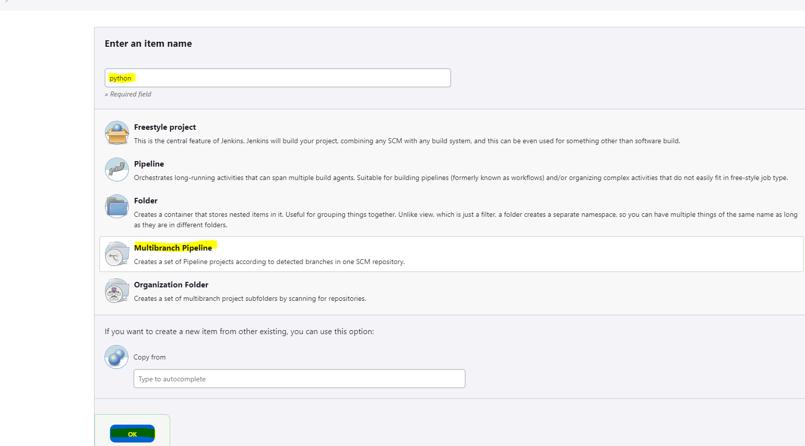
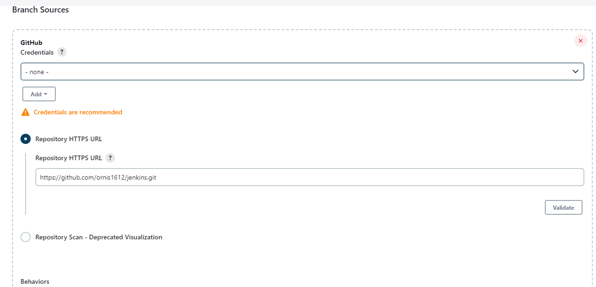
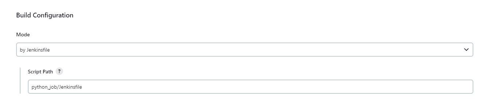

# Jenkins Project

## Prerequisites
1. Connect to linux vm, which docker and docker-compose are installed.

2. Create a .env file with the following environment variables:
```
JENKINS_ADMIN_ID=admin # Username for authentication the jenkins
JENKINS_ADMIN_PASSWORD=password # Password for authentication the jenkins
USER_NAME=ubuntu # The user which you have logged in of the linux vm
```

3. Run the following command to start the Jenkins server:
```
docker-compose up
```


## Instructions
1. Open the Jenkins dashboard and click "New Item" to create a new pipeline.
2. Select "Multibranch Pipeline" and enter a name for the pipeline.

3. In the "Branch Sources" section, click "Add Source" and select "GitHub".
4. Enter your GitHub repository URL and credentials.

5. In the "Build Configuration" section, set the "Script Path" to the path of your Jenkinsfile in the repository: `python_job/jenkins_file`.

6. Save the changes and the pipeline will automatically start running on any changes to your Git repository.


## Results
You will be able to see the pipeline running in the Jenkins dashboard.
The result is a docker running with an output.

